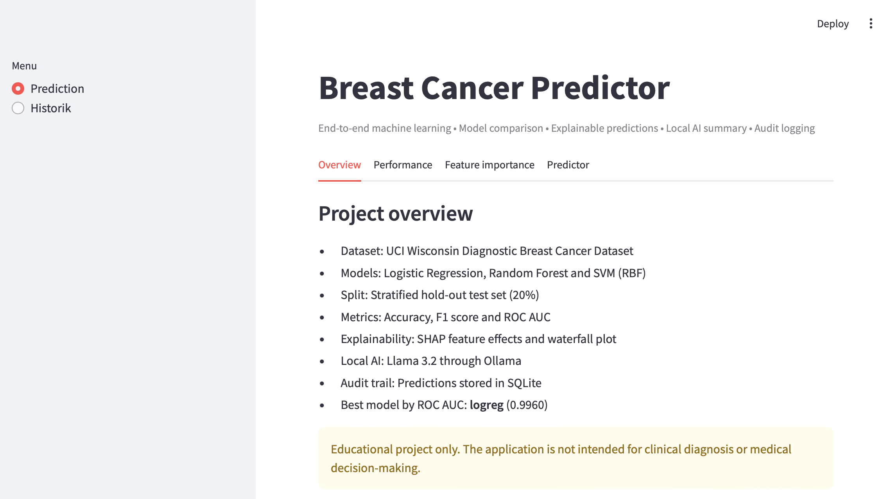
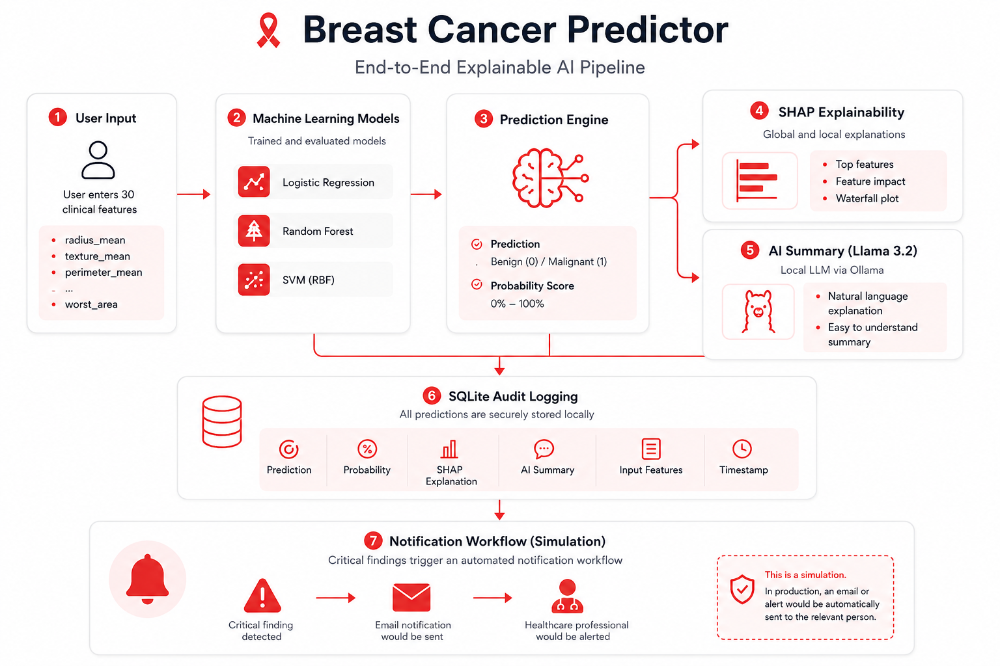
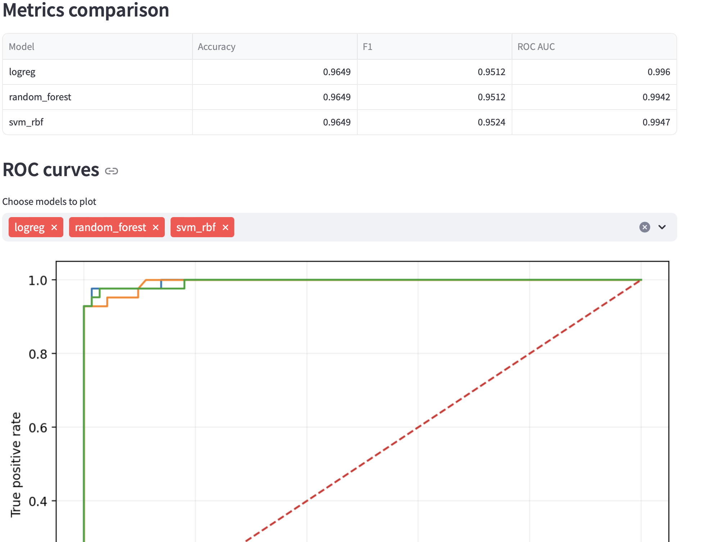
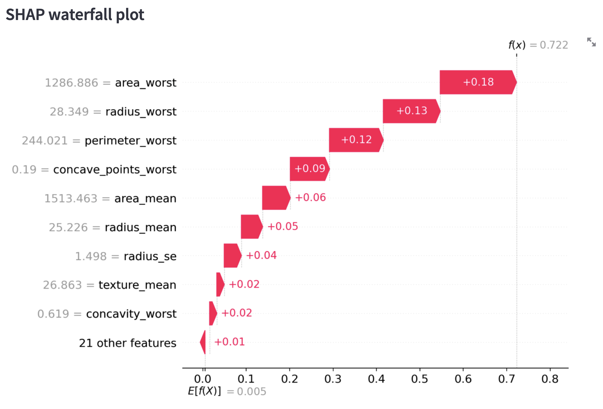
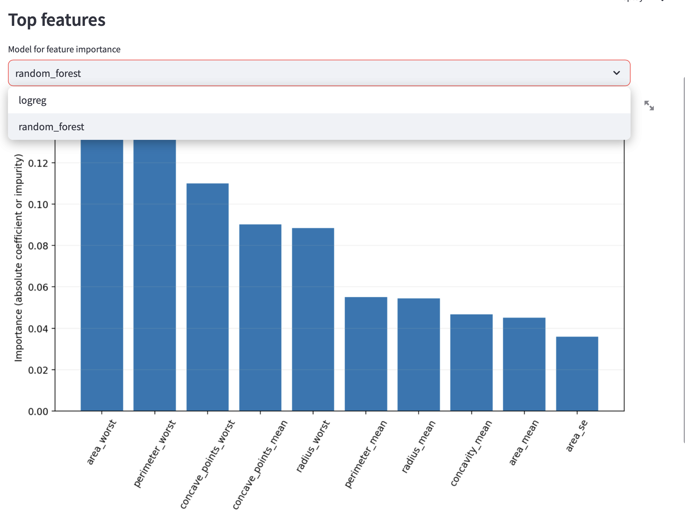
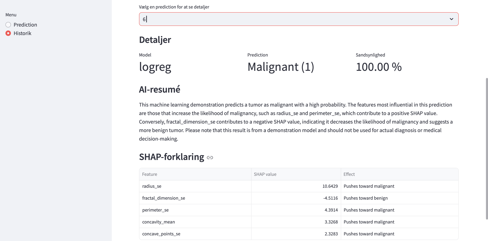
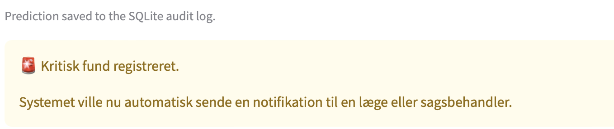

# Breast Cancer Predictor

An end-to-end machine learning application that combines model comparison, explainable AI, local LLM integration, automated audit logging and a simulated notification workflow.

The project demonstrates how a machine learning model can be developed into a complete and transparent AI application rather than remaining a standalone prediction model.

> **Educational project only:** This application is not intended for clinical diagnosis or medical decision-making.



---

## Project overview

The application predicts whether a breast tumour is classified as benign or malignant based on 30 numerical features from the Wisconsin Diagnostic Breast Cancer dataset.

Three classification models are trained and evaluated:

- Logistic Regression
- Random Forest
- Support Vector Machine with an RBF kernel

The selected model returns both a classification and a probability score. SHAP is then used to explain the individual prediction, while a local Llama 3.2 model converts the technical result into a short, understandable summary.

Every completed prediction is automatically stored in a SQLite audit log. When a malignant result is detected, the application also triggers a simulated notification workflow.

---

## AI workflow



The application follows this workflow:

1. The user enters 30 diagnostic features.
2. A trained machine learning model processes the input.
3. The application returns a prediction and probability score.
4. SHAP identifies the features that influenced the prediction.
5. Llama 3.2 generates a natural-language explanation locally through Ollama.
6. Input data, prediction, probability, SHAP explanation and AI summary are stored in SQLite.
7. A malignant result triggers a simulated critical-notification workflow.

---

## Main features

### Model training and comparison

The project trains and compares Logistic Regression, Random Forest and SVM models using:

- Accuracy
- F1 score
- ROC AUC
- ROC curves
- Stratified hold-out testing



### Interactive prediction

Users can select a model, enter feature values and receive:

- Benign or malignant classification
- Probability of malignancy
- Explanation of the result
- AI-generated summary


### Explainable AI with SHAP

The application does not only return a classification. It also shows which features pushed the prediction toward malignant or benign.

The explanation includes:

- Top contributing features
- Direction of each feature's effect
- SHAP values
- A local waterfall plot



### Global feature importance

Users can inspect which features are generally most influential for the supported models.



### Local AI summary

A local Llama 3.2 model is accessed through Ollama. It translates technical prediction and SHAP information into a short explanation written in natural language.

The language model runs locally rather than sending the prediction data to an external LLM service.



### SQLite audit logging

Each completed prediction is automatically stored in a local SQLite database.

The audit log contains:

- Timestamp
- Selected model
- Input features
- Prediction
- Malignancy probability
- SHAP explanation
- AI summary

The history page allows previous predictions to be reviewed directly in the Streamlit application.

### Simulated notification workflow

When the model predicts a malignant result, the application triggers a rule-based notification workflow.

The public demonstration displays a simulated alert. In a production environment, the same function could be replaced by an integration with:

- Email
- Microsoft Teams
- Slack
- A case-management system
- An internal notification service



---

## Technology stack

| Area | Technologies |
|---|---|
| Programming | Python |
| Machine learning | Scikit-learn |
| Data processing | Pandas, NumPy |
| Explainability | SHAP |
| User interface | Streamlit |
| Local language model | Llama 3.2, Ollama |
| Data storage | SQLite |
| Model persistence | Joblib |
| Visualisation | Matplotlib |
| Version control | Git, GitHub |

---

## Project structure

```text
breast-cancer-predictor/
├── assets/
├── breast-cancer+wisconsin+diagnostic/
├── models/
├── screenshots/
│   ├── ai-summary.png
│   ├── feature-importance.png
│   ├── model-performance.png
│   ├── notification.png
│   ├── overview.png
│   ├── prediction.png
│   ├── shap-waterfall.png
│   └── workflow-diagram.png
├── app.py
├── audit_log.py
├── email_notification.py
├── explain.py
├── llm.py
├── requirements.txt
├── train.py
└── README.md
```

---

## Installation

### 1. Clone the repository

```bash
git clone https://github.com/hassanisaq97-blip/hassanisaq97-blip-hassanisaq97-blip-breast-cancer-predictor.git
cd hassanisaq97-blip-hassanisaq97-blip-breast-cancer-predictor
```

### 2. Create a virtual environment

```bash
python3 -m venv .venv
source .venv/bin/activate
```

### 3. Install the required packages

```bash
pip install -r requirements.txt
```

### 4. Install and prepare Ollama

Install Ollama separately, then download the local model:

```bash
ollama pull llama3.2
```

Confirm that the model is available:

```bash
ollama list
```

### 5. Train the models

Run this step if the trained model files are not already available in the `models` directory:

```bash
python3 train.py
```

### 6. Start the application

```bash
python3 -m streamlit run app.py
```

The application should open automatically in the browser. Otherwise, open the local URL displayed in the terminal.

---

## Running the local AI component

Ollama must be running for the AI summary to work.

The application and Ollama are separate processes:

```text
Ollama server → Runs Llama 3.2 locally
Streamlit app → Provides the user interface and prediction workflow
```

If the AI summary is unavailable, confirm that Ollama is running and that `llama3.2` appears under:

```bash
ollama list
```

---

## What this project demonstrates

This project demonstrates practical experience with:

- Building an end-to-end machine learning application
- Training and comparing classification models
- Evaluating models with appropriate performance metrics
- Developing an interactive Streamlit interface
- Implementing local and global explainability with SHAP
- Integrating a local large language model
- Translating technical model outputs into understandable explanations
- Storing predictions and explanations in a SQLite audit trail
- Creating rule-based automation for critical results
- Structuring and documenting a complete AI project

---

## Limitations

- The application is an educational demonstration.
- The dataset does not represent a production clinical environment.
- The model has not been externally validated.
- The notification workflow is simulated.
- The application must not be used for diagnosis or treatment decisions.

---

## Possible future improvements

- Authentication and role-based access
- Exportable prediction reports
- Filtering and searching of prediction history
- Docker-based deployment
- Automated testing and continuous integration
- Cloud-hosted model API
- Integration with an enterprise notification service
- Model monitoring and drift detection

---

## Author

**Hassan Isaq**

MSc in Data Science with an interest in artificial intelligence, machine learning and the development of practical AI solutions.

GitHub: [hassanisaq97-blip](https://github.com/hassanisaq97-blip)