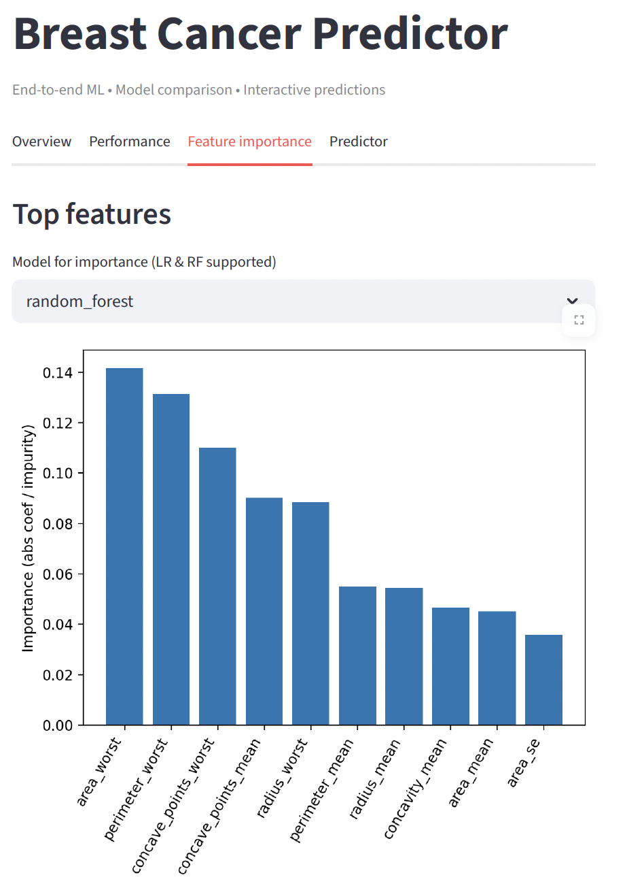

# Breast Cancer Predictor (UCI WDBC)

Dette projekt er en end-to-end Machine Learning-løsning, der forudsiger brystkræft (Malignant/Benign) ud fra diagnostiske målinger.  
Formålet er at demonstrere hele ML-workflowet: dataforberedelse, træning af flere modeller, evaluering og visualisering i en web-app bygget med Streamlit.

## Features

- Træning og sammenligning af tre modeller: Logistic Regression, RandomForest og SVM (RBF)
- Evaluering af modeller med Accuracy, F1 og ROC AUC
- Visualisering af ROC-kurver og feature importance
- Interaktiv predictor i Streamlit, hvor brugeren kan indtaste værdier og få en forudsigelse
- EDA-sektion i notebook med class balance, korrelations-heatmap og boxplots

## Screenshots

### Performance og ROC curves


### Feature importance


### Predictor


## Resultater (hold-out 20%)

| Model          | Accuracy | F1    | ROC AUC |
|----------------|---------:|------:|--------:|
| LogisticReg    | 0.9649   | 0.9512| 0.9960  |
| RandomForest   | 0.9649   | 0.9512| 0.9942  |
| SVM (RBF)      | 0.9649   | 0.9524| 0.9947  |

Resultaterne stammer fra `python train.py` og kan genskabes.

## Projektstruktur

breast-cancer-predictor/
├── app.py # Streamlit-app (tabs: overview, performance, importance, predictor)
├── train.py # Træner 3 modeller, gemmer estimators + summary.joblib
├── train.py.ipynb # Notebook med analyse/EDA og træning
├── models/
│ ├── summary.joblib # features + metrics + ROC-kurver + filstier til estimators
│ ├── logreg_est.joblib # Logistic Regression estimator
│ ├── logreg_scaler.joblib # Scaler til LR
│ ├── rf_est.joblib # RandomForest estimator
│ ├── svm_est.joblib # SVM (RBF) estimator
│ └── svm_scaler.joblib # Scaler til SVM
├── assets/ # Screenshots til README
│ ├── performance.png
│ ├── importance.png
│ └── predictor.png
├── requirements.txt # Python afhængigheder
└── (data ikke committet – se nedenfor)


## Sådan kører du projektet

### 1. Klon repo og gå ind i mappen
```bash
git clone <repo-url>
cd breast-cancer-predictor
2. Installer afhængigheder

Med conda:
conda create -n bc-predictor python=3.11 -y
conda activate bc-predictor
pip install -r requirements.txt
Med pip/venv:
python -m venv .venv
source .venv/bin/activate        # Windows: .venv\Scripts\activate
pip install -r requirements.txt
requirements.txt indeholder:
pandas
numpy
scikit-learn
streamlit
joblib
matplotlib

3. Data

Projektet anvender Breast Cancer Wisconsin (Diagnostic) datasættet fra
UCI Machine Learning Repository
.

Hent wdbc.data og placer den i mappen:

breast+cancer+wisconsin+diagnostic/wdbc.data
4. Træn modeller

python train.py

Dette genererer models/summary.joblib og gemmer alle estimators i models/.

5. Start app

python -m streamlit run app.py
App’en åbner i browseren (http://localhost:8501
).

I notebooken train.py.ipynb findes en kort analyse af datasættet:

Class balance

Korrelations-heatmap

Boxplots for top-features

Roadmap

Hyperparameter tuning (GridSearchCV / cross-validation)

Flere modeller (XGBoost, LightGBM)

SHAP/Explainable AI for feature-forklaring

Deployment på Streamlit Cloud

Udvidelse til flere “Medical ML apps” (fx Diabetes, Heart Disease)

Credits

Data: UCI Machine Learning Repository

Kode: MIT License

